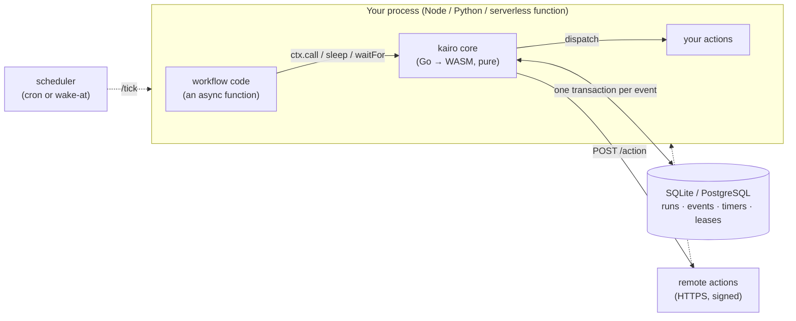

<div align="center">

# kairo

**Durable workflows that run inside your app.<br>No workflow server, no broker: a WASM core and your database.**

[](https://github.com/r-hashi01/kairo/actions/workflows/ci.yml)
[](LICENSE)


</div>

---

kairo is a workflow runtime for building workflow tools: agents, LLM pipelines, approval flows, anything that has to survive a crash, wait for a human, or call the outside world exactly once.

Write a workflow as an ordinary `async` function. Every call it makes is recorded. Kill the process halfway, run the function again on any machine, and it picks up where it stopped: finished calls return their recorded results, and nothing that acts on the world runs twice.

```ts
k.workflow('refund', async (ctx, req: { order: string; amount: number }) => {
  const verdict = await ctx.call('classify', req);            // an LLM call: safe to retry
  if (verdict.risky) await ctx.waitFor('approve');             // wait days for a human, at no cost
  await ctx.sleep(60_000);                                     // durable timer
  return ctx.call('refund-payment', req);                      // acts outside: never runs twice
});
```

## Why kairo

- **No server to run.** The engine is a pure Go core compiled to WebAssembly (1.2 MB gzipped). It runs inside your Node or Python process, and SQLite or PostgreSQL is the only infrastructure. There is no daemon, no broker and no worker fleet to operate.
- **Serverless first.** In suspend mode, a function invocation advances a workflow as far as it can and returns. A scheduler's `/tick` or a one-off `wake(at)` brings it back exactly when the next timer is due. Nothing polls.
- **Effects have types.** You declare each action as `real` (it acts on the world) or `unprotected` (safe to repeat). A real step is dispatched only after its intent is committed. If its outcome is unknown, it is never retried blindly; it stops for review.
- **Branch on types, not on text.** Conditions test only typed fields (bool, int, number, enum). Pair this with typed LLM decisions ([kairo-jev](docs/jev.md)) and an agent's choice drives the graph without parsing prose.
- **Long work, anywhere.** Actions can live behind an HTTPS URL, on a GPU box or another service. Calls are signed, and results come back in the response or later through a signed callback.
- **It cleans up after itself.** Finished runs are removed with everything they started once a retention window passes (`KAIRO_KEEP_FINISHED`, 24 h by default). A workflow that is still waiting keeps its history for as long as it needs.
- **The runtime is not the bottleneck.** The core applies an event in about 1 µs natively and about 20 µs in Node's WASM. End to end, the database is the limit.

## Quick start

> [!NOTE]
> kairo has not been released yet. The SDKs will be published as **`kairo-sdk`** on npm and PyPI. Until then, [build them from source](#from-source).

### TypeScript (Node 22+)

```ts
import { EmbeddedBackend, Kairo, SQLiteStore } from 'kairo-sdk';

const k = new Kairo({ backend: await EmbeddedBackend.open({ store: new SQLiteStore('kairo.db') }) });

k.defineAction('classify', {
  effect: 'unprotected',                       // may run again after a crash
  handler: async (req: { amount: number }) => ({ risky: req.amount > 100 }),
});
k.defineAction('refund-payment', {
  effect: 'real',                              // recorded before it runs; never twice
  handler: async (req: { order: string }) => ({ refunded: req.order }), // call your payment API here
});

k.workflow('refund', async (ctx, req: { order: string; amount: number }) => {
  const verdict = await ctx.call('classify', req);
  if (verdict.risky) await ctx.waitFor('approve');
  return ctx.call('refund-payment', req);
});

await k.start();
console.log(await k.run('refund', { order: 'o-42', amount: 250 }, { id: 'refund-o-42' }));

// Meanwhile, from your API, a Slack button, another process:
//   await k.signal('refund-o-42', 'approve', { by: 'alice' });
```

### Python (3.12+)

```python
import asyncio
from kairo_worker import EmbeddedBackend, Kairo, SQLiteStore

async def main():
    k = Kairo(backend=await EmbeddedBackend.open(SQLiteStore("kairo.db")))

    @k.action("classify", effect="unprotected")
    def classify(req, ctx):
        return {"risky": req["amount"] > 100}

    @k.action("refund-payment")                # effect="real" is the default
    def refund_payment(req, ctx):
        return {"refunded": req["order"]}   # call your payment API here

    @k.workflow("refund")
    async def refund(ctx, req):
        verdict = await ctx.call("classify", req)
        if verdict["risky"]:
            await ctx.wait_for("approve")
        await ctx.sleep(5)                     # a durable timer
        return await ctx.call("refund-payment", req)

    await k.start()
    print(await k.run("refund", {"order": "o-42", "amount": 50}, id="refund-o-42"))

asyncio.run(main())
```

Run either one, kill it at any point, and run it again: the workflow resumes, and `refund-payment` runs exactly once.

## How it works



- **Each call is a run.** A call's id is derived from the workflow id and the call's input, so running the function again finds the same runs. Those that finished return their output.
- **One event, one transaction.** Applying an event locks the run's row, appends the event, replaces the state and arms timers. Commands are carried out after the commit, and a real step's intent is committed before it is dispatched.
- **Leases, not heartbeats from a server.** A step dispatched to a process is leased to it. If the process dies, whoever finds the expired lease records an unknown outcome. An unprotected step runs again; a real one stops for review.
- **The core is pure.** It does no I/O and reads no clock, and the same events always produce the same state bytes. The Go engine, the WASM build and both SDKs share it.

## Serverless

```ts
// app/api/kairo/[...path]/route.ts: one route serves remote actions,
// their callbacks and the scheduler's tick.
async function handle(req: Request) {
  const k = new Kairo({
    backend: await EmbeddedBackend.open({ store: new PostgresStore(pool) }),
    mode: 'suspend',                          // advance as far as possible, then return
    tickSecret: process.env.CRON_SECRET,      // what Vercel Cron sends
    wake: scheduleOneOffTick,                 // e.g. EventBridge at(), Cloud Tasks, QStash
  });
  defineWorkflows(k);
  await k.start();
  try { return await k.fetchHandler()(req); } finally { await k.close(); }
}
export { handle as GET, handle as POST };
```

```json
// vercel.json: a coarse safety net; wake(at) does the precise wake-ups
{ "crons": [{ "path": "/api/kairo/tick", "schedule": "*/5 * * * *" }] }
```

Recipes for Vercel, AWS Lambda with EventBridge Scheduler, Cloud Tasks, QStash and ASGI are in **[docs/serverless.md](docs/serverless.md)** (Japanese).

## kairod: when you can keep a process running

The embedded runtime needs nothing but a database. If you can run a resident process, **kairod** (`cmd/kairod`) gives the same model more headroom:

- microsecond hand-offs, with an in-memory engine and a write-ahead log
- per-destination RPM/TPM limits and fair scheduling across tenants and processes
- workers in any language pulling tasks over a credit-based protocol
- graphs defined in JSON over an HTTP API, with live token streaming over SSE
- storage in files, or SQLite, PostgreSQL, MySQL, TiDB or Oracle, with optional encryption at rest

## Performance

**Embedded runtime** (Apple M4 Max). Per event = decode the state, apply, encode it again.

| | per event | end to end |
|---|---:|---|
| native Go | ~5 µs | |
| Node + WASM | ~20 µs | ~2,400 runs/s on SQLite (one process, `synchronous=FULL`) |
| Python + WASM | ~111 µs | |
| any of the three + PostgreSQL | | ~460–490 runs/s with 16 in flight: the database is the limit |

**kairod** (`scripts/bench.sh`, Linux on GitHub Actions; each number is checked against a budget in CI)

| | measured | budget |
|---|---:|---:|
| transition cost | 1.4 µs | ≤ 20 µs |
| runtime CPU per 5-node run | 34 µs | ≤ 1 ms |
| throughput, 5-node runs | ~105,000 runs/s | — |
| node hand-off latency, p99 | 0.72 ms | ≤ 1 ms |
| memory per waiting run | 2.0 KB | ≤ 20 KB |
| durable ack, p99 (group commit, fsync) | 1.7 ms | ≤ 5 ms |

## Guarantees

Each of these is enforced by a test or a hook, and breaking one is a correctness bug, not a performance regression.

1. The core is pure: no I/O, no clock, no goroutines, no locks, no randomness.
2. Replaying the same events produces the same state bytes.
3. A real command is never released on the strength of state that is not yet durable.
4. A real command whose outcome is unknown is never treated as success, and never re-run without `idempotent_retry`.
5. No goroutine per run, and no polling: a waiting workflow costs only its state bytes.
6. Logs are append-only; snapshots and blobs are replaced atomically.

The full list, with the tests behind each, is in [AGENTS.md](AGENTS.md). Every design decision is recorded in [docs/adr](docs/adr/README.md) (more than 50 ADRs, in Japanese).

## Repository

| | |
|---|---|
| `core/` `ir/` | the pure state machine, the plan compiler and its graph IR |
| `wasmcore/` `cmd/kairo-wasm/` | the core as a WASM module for the SDKs |
| `sdk/ts/` `sdk/python/` | the SDKs: the embedded runtime, workflows as code, HTTP actions, scheduler entry points |
| `engine/` `sched/` `wal/` `timerwheel/` | kairod's engine: shards, admission and quotas, write-ahead log, timers |
| `cmd/kairod/` `api/` `protocol/` | the daemon, its HTTP API and the worker protocol |
| `store/` | SQL backends for kairod (each a module of its own) |
| `httpaction/` `executor/` | actions over HTTP(S) in Go; built-in executors (HTTP, [TypeSafe Jev](docs/jev.md)) |
| `compat/` | experiments that ran Dify and n8n workflows on kairo, used to measure it |

The core module depends on the Go standard library only. Anything with a third-party dependency lives in a module of its own.

## From source

```sh
# TypeScript SDK (builds kairo.wasm with Go 1.27+, then the package)
cd sdk/ts && npm install && npm run build && npm pack      # → kairo-sdk-0.1.0.tgz

# Python SDK
GOOS=wasip1 GOARCH=wasm go build -trimpath -buildmode=c-shared \
  -o sdk/python/kairo_worker/wasm/kairo.wasm ./cmd/kairo-wasm
pip install "./sdk/python[embedded]"

# kairod
go build -o kairod ./cmd/kairod && ./kairod -data ./data
```

## Development

```sh
make check   # gofmt, vet, build, every test (Go, TypeScript, Python), the invariants
make race    # the same with the race detector
make bench   # the performance budgets: fails when one is exceeded
```

Contributors and coding agents start with [AGENTS.md](AGENTS.md): it covers how to work here, the invariants, and what each kind of change needs. A change that touches an invariant, a format or a dependency starts as an ADR.

## License

[MIT](LICENSE)
